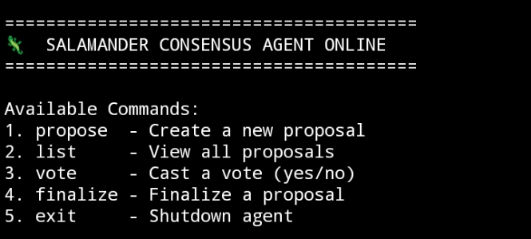
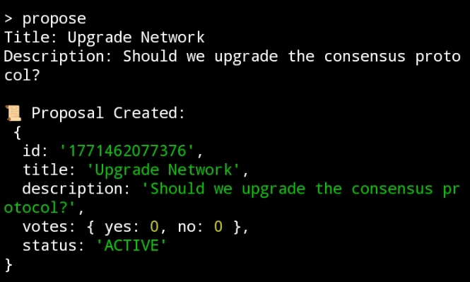
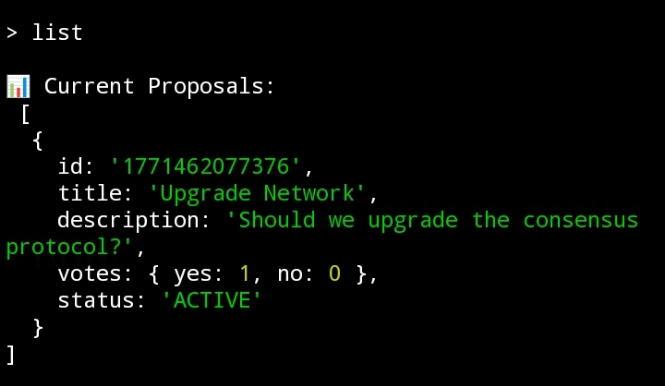

# 🦎 Salamander Consensus

> A decentralized peer-to-peer governance and consensus agent built on Intercom infrastructure.

Forked from: Trac-Systems/intercom  
Built by: @kingsalamanderz  

---

## 🧠 Overview

Salamander Consensus extends the Intercom peer stack
by introducing a lightweight governance layer.

Agents can:

- Create proposals
- Cast yes/no votes
- Track live voting status
- Finalize governance outcomes

Designed for modular CLI execution and future peer integration.

---

## ⚙️ Installation

1️⃣ Clone repository
    • git clone https://github.com/kingsalamanderz/salamander-consensus.git
    • cd salamander-consensus/salamander-agent
2️⃣ Install dependencies
    • npm install
3️⃣ Run the agent
    • node index.js

---

## 🗳 Features

- Proposal Creation Engine  
- Yes / No Voting System  
- Proposal Finalization  
- Real-time Vote Tracking  
- Lightweight CLI Architecture  

---

## 📸 Proof of Execution

### 🦎 Agent Initialization

Agent successfully initialized and displayed governance commands.

---

### 📜 Proposal Creation

A governance proposal titled **"Upgrade Network"** was created.

---

### 📊 Proposal Listing

The engine displayed active proposals with ID and status.

---

### 🗳 Voting Process

A vote was successfully recorded within the consensus module.

---

### ✅ Proposal Finalization

The proposal status transitioned to **FINALIZED**.

---

## 💰 Trac Address

    trac1sesag5xrcxfek5z2w4tsd47szeqh2f5u2q4dxv5g7acdypnxe8wsa3ccsu

---

## 📡 Architecture

Intercom Peer Layer  
→ Salamander Consensus Engine  
→ Proposal State Management  
→ Governance Finalization  

---

Built for decentralized peer experimentation and governance research.
