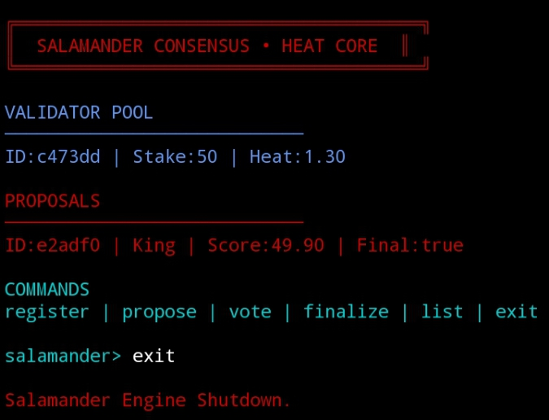

# SALAMANDER CONSENSUS
### Heat Core Voting Engine – Red/Blue Panel Edition

An adaptive consensus engine featuring stake-weight voting,
validator heat dynamics, and colored CLI dashboard rendering.

This fork upgrades the base system into a heat-based
dynamic consensus simulation model.

━━━━━━━━━━━━━━━━━━━━━━━━━━━━━━━━━━━━━━━━━━

## 🧠 Core Concept

Salamander Consensus introduces:

• Stake-weighted voting  
• Validator heat amplification  
• Heat decay over time  
• Dynamic proposal scoring  
• Consensus threshold validation  
• Red/Blue panel CLI interface  

Voting weight formula:

Effective Vote = stake × heat

Heat increases when actively voting  
Heat decays when idle

━━━━━━━━━━━━━━━━━━━━━━━━━━━━━━━━━━━━━━━━━━

## 🔥 Features

• Adaptive Heat Engine  
• Stake-Based Weighted Voting  
• Dynamic Validator Activity Tracking  
• Proposal Finalization Logic  
• Real-Time Score Calculation  
• Colored CLI Dashboard  
• Runtime State Engine  

━━━━━━━━━━━━━━━━━━━━━━━━━━━━━━━━━━━━━━━━━━

## 🖥 Panel Dashboard

TRAC Address:
trac1sesag5xrcxfek5z2w4tsd47szeqh2f5u2q4dxv5g7acdypnxe8wsa3ccsu

━━━━━━━━━━━━━━━━━━━━━━━━━━━━━━━━━━━━━━━━━━

## ⚙️ Installation

git clone https://github.com/kingsalamanderz/salamander-consensus.git  
cd salamander-consensus  
node index.js  

━━━━━━━━━━━━━━━━━━━━━━━━━━━━━━━━━━━━━━━━━━

## 🧩 Available Commands

register   → Register validator with stake  
propose    → Create new proposal  
vote       → Cast weighted vote  
finalize   → Finalize proposal  
list       → Refresh dashboard  
exit       → Shutdown engine  

━━━━━━━━━━━━━━━━━━━━━━━━━━━━━━━━━━━━━━━━━━

## 🧮 Consensus Logic

Heat decay model:

heat = heat − (0.1 × hoursIdle)  
minimum heat = 0.5  

Consensus threshold:

score ≥ 100 → Consensus Achieved  
score < 100 → Consensus Failed  

━━━━━━━━━━━━━━━━━━━━━━━━━━━━━━━━━━━━━━━━━━

## 🏗 Architecture

• Node.js CLI Engine  
• Stateful Validator Pool  
• Proposal Scoring Layer  
• Heat Mutation System  
• Dynamic Rendering Layer  
• ANSI Color UI System  

━━━━━━━━━━━━━━━━━━━━━━━━━━━━━━━━━━━━━━━━━━

## 🚀 Why This Fork Is Different

This version introduces:

• Adaptive validator heat modeling  
• Weighted dynamic consensus scoring  
• Colored red/blue CLI rendering  
• Proposal lifecycle control  
• Enhanced validator mutation logic  

This is not a cosmetic fork —  
it upgrades voting mechanics and consensus behavior.

━━━━━━━━━━━━━━━━━━━━━━━━━━━━━━━━━━━━━━━━━━

## 📜 License

MIT License – Heat Core Edition
